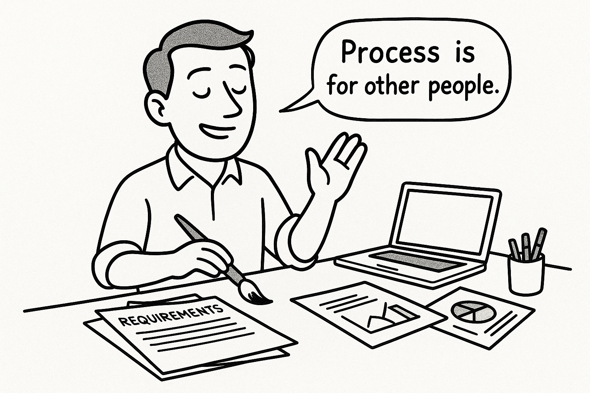

# The Ego Trap That's Killing Your Team's Productivity

*Without structure, every project becomes dependent on individual heroics*

Process and systems are great for *other* people.

External teams need requirements documents. Stakeholders need clear scope. Everyone else needs discipline and structure.

But our work? That's different. That's art. There's some magical alchemy between us and whatever result we're chasing that just... works.

**Until it doesn't.**

## The Individual Contributor Delusion

I've watched this play out over my career countless times. Multiple team members tasked with creating high impact and value on a repeated bases, with few guardrails or guidance in sight.

The process? There isn't one.

No standardized requirements gathering. No PRDs. No business requirements documents. No templates.

Just specialists relying on their personal communication skills and social abilities to figure out what stakeholders actually want.

The result? Another report, another tool. Always a new tool.

## When "Because I Said So" Becomes Strategy

Here's what happens without process: unlimited change requests, constantly shifting requirements, and zero clarity on why we're building anything beyond "because someone asked."

The ego tells us we don't need structure. We're smart enough to figure it out as we go. Process is for less capable people.

But that's exactly backwards.

## The Real Cost of Flying Solo

Without standardized approaches, every project becomes dependent on individual heroics. Success becomes random. Quality becomes inconsistent.

And when people leave? All that tribal knowledge walks out the door.

The irony is brutal: The very processes we think limit our creativity are what enable us to scale our impact.

A requirements template doesn't stifle innovation. It prevents you from building the wrong thing beautifully.

## The Discipline Deficit

The number one way I see ego sabotaging teams isn't through grand gestures or obvious power plays.

It's in the quiet resistance to doing the boring, unsexy work of documenting best practices to what we do well. Of following processes. Of admitting that maybe, just maybe, we need structure to do our best work.

Your expertise isn't diminished by using a template. It's amplified by it.

------------------------------------------------------------------------

**What processes has your ego convinced you that you don't need? And more importantly - what's it costing your team when you skip them?**

**Hit reply and tell me about the "creative" workarounds that are actually slowing you down.**
