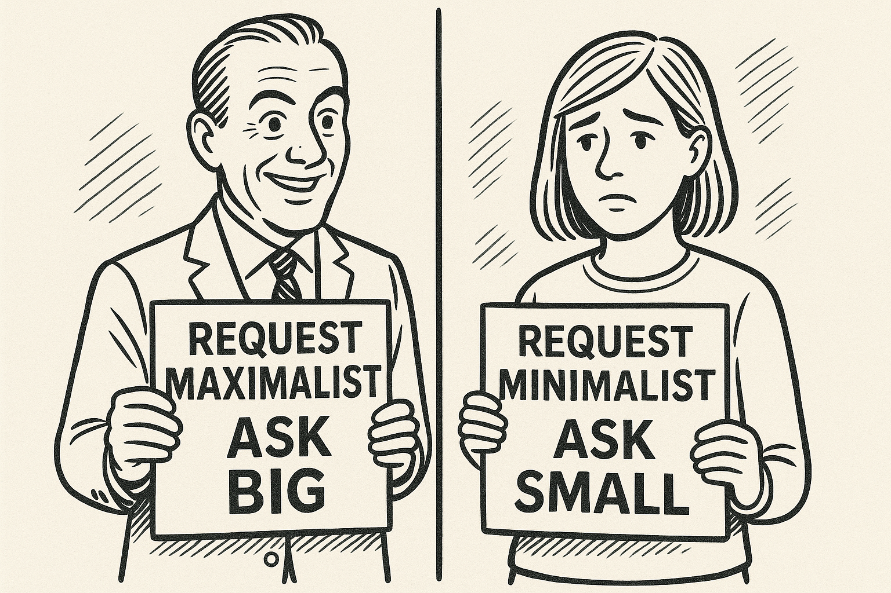

# The Two Types of People (And Why It Matters at Work)

*All requests are impositions. All impositions carry a tax.*

When it comes to making requests, there are only two types of people.

**Request maximalists and request minimalists.**

Maximalists ask big. If you ask how much they need, they’ll counter with: “Well, how much you got?” No hesitation. No friction.

Minimalists ask small. If they need \$500 for a car repair, they ask for \$500. Not a dollar more. Not a dollar less.

**Here’s where the clash happens.**

Minimalists assume requests reflect true need. So if someone asks for a million-dollar budget, they believe the work actually requires a million. But it usually doesn’t. Maximalists size requests to aspiration, not reality.

**All requests carry a tax.\**
\
And when maximalists ask, minimalists feel the weight of that tax more than the asker ever will.

I’m a request minimalist. I hate asking for help. When I do, I’m careful to match the request exactly to what’s needed. No padding. No extras.

**But here’s the problem: maximalists often don’t realize the pressure they create.**

You see it everywhere in tech:

- The PM’s “quick favor” that eats half your day.

- The manager asking for “any availability” that hijacks your calendar.

- The colleague wanting a “small introduction” that actually means access to your entire network.

**Knowing which camp you - and others - fall into matters.**

It shapes how you set boundaries. How you frame asks. And how you decide when to say yes - or no.
